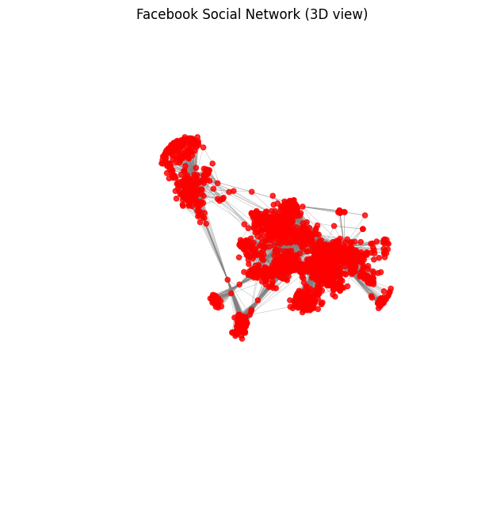
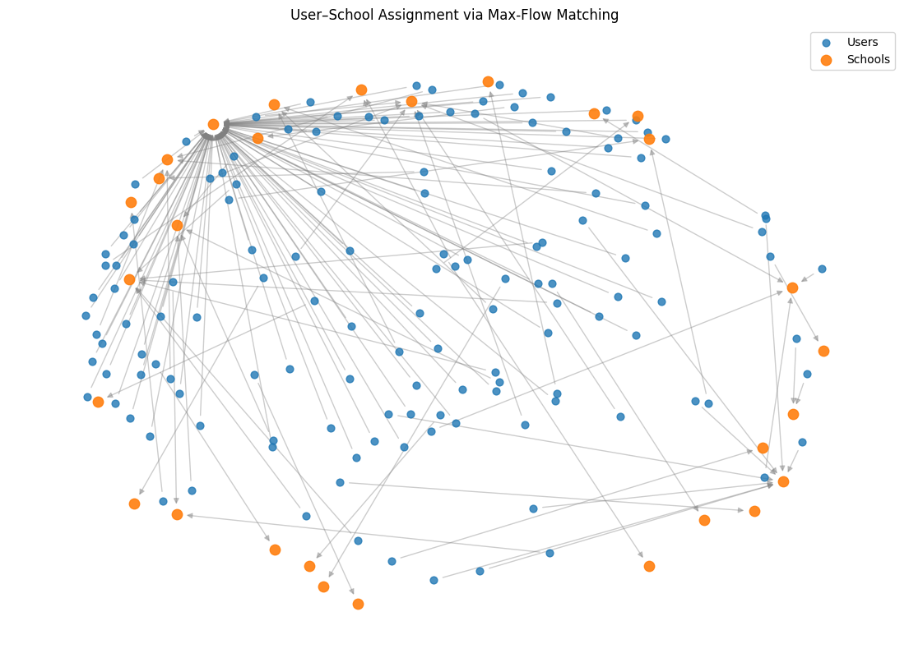
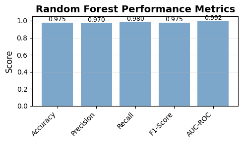
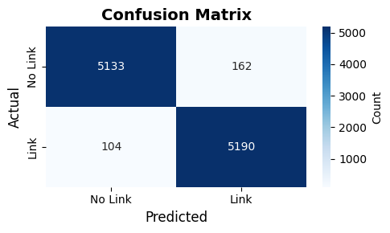
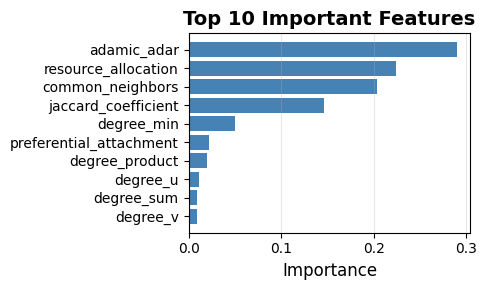

# Facebook Social Network Graph Analysis 

Graph algorithms course project applying custom implementations of BFS, connected components, centrality measures, Edmonds–Karp max-flow, and ML-based link prediction to the **Facebook Social Network ([SNAP](https://snap.stanford.edu/data/ego-Facebook.html))** dataset (4,039 nodes / 88,234 edges).

## Tasks

### 1 — Network Connectivity Analysis

Built a `SocialGraph` class on an adjacency-list representation with:
- `find_connected_components()` — BFS traversal to group nodes into components
- `bfs_shortest_paths_from(source)` / `shortest_path(source, target)` — BFS shortest paths (unweighted graph, so hop count is minimal)
- `reach_over_time_from(source)` — models information diffusion, treating each hop as one time step
- `degree_centrality_top10()`, `closeness_centrality_top10()`, `betweenness_centrality_top10()` (Brandes' algorithm)

**Results:**
- Connected components: **1** — the whole network is reachable from any node
- Shortest path (node 0 → node 1234): `[0, 107, 1234]` — 2 hops
- Diffusion from node 0 reaches all 4,039 nodes in **6 time steps** (348 → 1,519 → 3,261 → 3,780 → 3,897 → 4,039 cumulative)
- Centrality: nodes **107** and **1684** rank in the top 10 across degree, closeness, *and* betweenness — identified as the network's core/bridge nodes

### 2 — Pair Matching Problem

Used the ego-network for user `0` from `facebook.tar.gz`, extracting school-related features (`education;school;id`, feature IDs 24–52) from the `.feat`/`.featnames` files. Modeled user-to-school assignment as a flow network:
- Source → Users: capacity 1 (each user assigned to one school)
- Users → Schools: capacity 1, edge exists if the user has that school feature
- Schools → Sink: capacity set to 50% of each school's observed demand (α = 0.5)

Solved with a from-scratch **Edmonds–Karp** max-flow implementation (BFS-based augmenting paths).

**Results:**
- Max flow / users successfully matched: **138 out of 222** (~62%)

### 3 — Link Prediction with ML

Split `facebook_combined.txt.gz` edges 80/20 (train/test) before feature extraction to avoid leakage, then generated an equal number of negative (non-edge) samples for a balanced binary classification set. Extracted graph-theoretic features per node pair:
- **Degree-based:** degree of each node, sum, product, difference, min, max
- **Neighborhood-based:** common neighbors, Jaccard coefficient, Adamic–Adar index, preferential attachment, resource allocation index

Features normalized with `StandardScaler`; trained a **Random Forest** classifier (`n_estimators=100, random_state=42`) on 24,705 training samples, evaluated on 10,589 validation samples.

**Results:**

| Accuracy | Precision | Recall | F1-Score | AUC-ROC |
|---|---|---|---|---|
| 97.49% | 96.97% | 98.04% | 97.50% | 0.9924 |

Top features: **Adamic–Adar** (0.29), **resource allocation** (0.22), **common neighbors** (0.20), **Jaccard** (0.15) — neighborhood-based signals dominate over raw degree.

